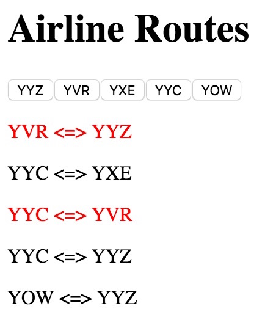

# Lab 3: Creating DOM elements using JavaScript

In this lab, you will build a web page that displays a list of direct flights between cities (represented by their 3-letter airport codes). The cities and their routes are dynamically loaded into the web page.

## Learning objectives

- Use plain JavaScript to add and modify elements in a web page
- Get some practice writing JavaScript code using arrays and objects
- Write a callback function to handle button click events
- Recognize the use of a closure in the callback function

## Instructions

You are given a web page with a `div` with the `id="cities"` that will contain one button for each of the cities. The other `div` on the page is where the list of routes will go.

When a user click on one of the city buttons, all of the routes containing the city will be coloured red (the rest will be coloured black).

**Step 1:** Complete the `buildRoutes` function that will construct the DOM elements to display the routes.

**Step 2:** Complete the `buildCities` function to construct the buttons for each city. At this point, you should be able to load the web page to see that everything is displayed correctly.

**Step 3:** Write the function that will be called when a button is clicked. When a button is clicked, you will need to be able to find the elements that contain a route with that city. There are a variety of ways to do this. One approach is to use class attributes in the elements, and this approach is described in the comments in `lab3.js`. You are welcome to choose another approach if you prefer.

*Tip*: Try using [`let`](https://developer.mozilla.org/en-US/docs/Web/JavaScript/Reference/Statements/let) when declaring variables, instead of `var`.

*Note*: It is tempting to want to pass an argument to your callback function,
but you should remember what variables you have available to you in the lexical
scope and see how closures can help you out in this case.

Here is an example of what your web page will look like after YVR has been clicked:

    

Aside: visual style is not evaluated in this lab, but it may be altered for practice, if desired.

## Looking for more?

Here are some suggestions to make this web page more interesting:
- Modify the interface so that you can show one-hop and two-hop routes between two end points
- Instead of colouring the text differently, display only the relevant routes after a button is clicked
